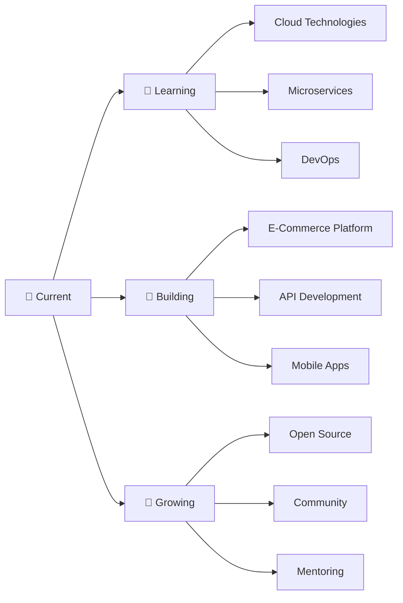

  

  

###

## 🚀 About Me

- 🌟 **Full Stack Developer** passionate about creating innovative solutions
- 🎯 Currently focusing on **.NET Core** and **Modern Web Technologies**
- 🚀 Building **scalable applications** that make a difference
- 🌱 Always **learning and exploring** new technologies
- ⚡ Love turning **ideas into reality** through code
- 🎮 When not coding, I enjoy **problem-solving challenges**

###

  
  <h2>🌟 Tech Stack Mastery</h2>
  

  

  
| Frontend | Backend | Database | Tools |
|----------|---------|----------|-------|
|  |  |  |  |
|  |  |  |  |
|  |  |  |  |
|  |  |  |  |

###

  
  <h2>📱 Connect With Me</h2>
  

  
  
  
  
  

###

  
  <h2>🏆 GitHub Achievements</h2>
  

  

###

###

###

###

###

###

###

###

###

  
  <h2>🏅 Achievements & Metrics</h2>
  

  

###

###

  
  <h2>🎮 Coding Stats</h2>
  

  

  
  
  

###

  
  <h2>🎯 Goals & Learning Path</h2>
  

###

###

  

  <h3>
    
  </h3>

###
