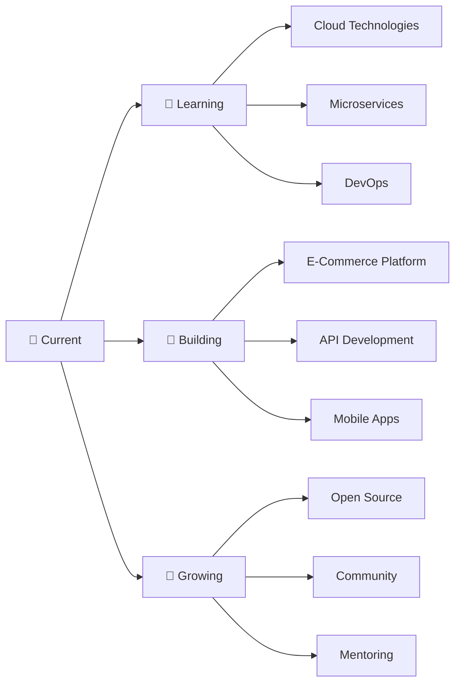

  

###

## 🚀 About Me

- 🤖 **AI & LLM Developer**: Building intelligent systems using **Ollama**, **Local LLMs**, and **Agentic AI**.
- 🎯 **Full Stack Expert**: Deep expertise in **.NET Core**, **C#**, and modern Web Architectures.
- 🐍 **Python Specialist**: Leveraging **Python** and **PostgreSQL** for data-driven AI applications.
- 🚀 **Scalability Focus**: Architecting robust **AI Chatbots** and high-performance backends.
- ⚡ **Problem Solver**: Passionate about turning complex logic into seamless user experiences.

###

  <h2>🌟 Tech Stack Mastery</h2>

  

| AI & Intelligence | Backend | Frontend | Database | Tools |
| :--- | :--- | :--- | :--- | :--- |
|  |  |  |  |  |
|  |  |  |  |  |
|  |  |  |  |  |
|  | |  | |  |

###

  <h2>📱 Connect With Me</h2>

  
  
  
  
  

###

  
  <h2>🏆 GitHub Achievements</h2>
  

###

###

###

###

###

###

###

###

###

###

###

  <h2>🎮 Coding Stats</h2>

  
  
  

###

  <h2>🎯 Goals & Learning Path</h2>

```mermaid
graph LR
    A[🎯 Current] --> B[🚀 Learning]
    A --> C[💼 Building]
    A --> D[🌱 Growing]
    
    B --> E[Cloud Technologies]
    B --> F[Microservices]
    B --> G[DevOps]
    
    C --> H[E-Commerce Platform]
    C --> I[API Development]
    C --> J[Mobile Apps]
    
    D --> K[Open Source]
    D --> L[Community]
    D --> M[Mentoring]
```

###

###

  

  <h3>
    
  </h3>

###
