```mermaid
graph LR
    A[🎯 Current] --> B[🚀 Learning]
    A --> C[💼 Building]
    A --> D[🌱 Growing]
    
    B --> E[Cloud Technologies]
    B --> F[Microservices]
    B --> G[DevOps]
    
    C --> H[E-Commerce Platform]
    C --> I[API Development]
    C --> J[Mobile Apps]
    
    D --> K[Open Source]
    D --> L[Community]
    D --> M[Mentoring]
```

<div align="center">
  
</div>

<div align="center">
  
</div>

###


## 🚀 About Me

- 🌟 **Full Stack Developer** passionate about creating innovative solutions
- 🎯 Currently focusing on **.NET Core** and **Modern Web Technologies**
- 🚀 Building **scalable applications** that make a difference
- 🌱 Always **learning and exploring** new technologies
- ⚡ Love turning **ideas into reality** through code
- 🎮 When not coding, I enjoy **problem-solving challenges**

###

<div align="center">
  
  <h2>🛠️ Tech Stack & Tools</h2>
  
</div>

<div align="center">
  
</div>

###

<div align="center">
  
  <h2>📱 Connect With Me</h2>
  
</div>

<div align="center">
  <a href="https://discord.com/channels/@me/995030735784247367" target="_blank">
    
  </a>
  <a href="mailto:abdulrahmannadap@gmail.com" target="_blank">
    
  </a>
  <a href="https://www.linkedin.com/in/aabdulrhman-nadap-1ab389255/" target="_blank">
    
  </a>
  <a href="https://stackoverflow.com/users/21017383/arhman-nadap" target="_blank">
    
  </a>
  <a href="https://codepen.io/Abdulrahmannadap" target="_blank">
    
  </a>
</div>

###

<div align="center">
  
  <h2>🏆 GitHub Achievements</h2>
  
</div>

<div align="center">
  
</div>

###

<div align="center">
  
  <h2>📊 GitHub Analytics</h2>
  
</div>

<div align="center">
  
  
</div>

###

<div align="center">
  
</div>

###

<div align="center">
  
  <h2>📈 Contribution Activity</h2>
  
</div>

<div align="center">
  
</div>

###


###

<div align="center">
  
  <h2>💼 Professional Skills</h2>
  
</div>

<div align="center">
  <table>
    <tr>
      <td align="center" width="200">
        
        <br><strong>Frontend</strong>
        <br>HTML5, CSS3, JavaScript
      </td>
      <td align="center" width="200">
        
        <br><strong>Backend</strong>
        <br>C#, .NET Core, ASP.NET
      </td>
      <td align="center" width="200">
        
        <br><strong>Database</strong>
        <br>MySQL, SQL Server
      </td>
      <td align="center" width="200">
        
        <br><strong>Tools</strong>
        <br>Git, GitHub, VS Code
      </td>
    </tr>
  </table>
</div>

###

<div align="center">
  
  <h2>🎯 Current Focus</h2>
  
</div>

<div align="center">
  
```javascript
const abdulrahman = {
    currentlyLearning: ["Advanced .NET", "Cloud Technologies", "Microservices"],
    workingOn: ["E-Commerce Platform", "API Development", "Database Optimization"],
    collaborating: ["Open Source Projects", "Community Initiatives"],
    askMeAbout: ["Web Development", "C# Programming", "Database Design"],
    funFact: "I debug with console.log and I'm proud of it! 😄"
};
```

</div>

###

<div align="center">
  
  <h2>🐍 Contribution Snake</h2>
  
</div>

<div align="center">
  
</div>

###

<div align="center">
  
  <h2>📊 Detailed Statistics</h2>
  
</div>

<div align="center">
  
  
</div>

<div align="center">
  
  
</div>

###

<div align="center">
  
  <h2>🏅 Achievements & Metrics</h2>
  
</div>

<div align="center">
  
</div>

<div align="center">
  
</div>

###

<div align="center">
  
  <h2>🌟 Tech Stack Mastery</h2>
  
</div>

<div align="center">
  
</div>

<div align="center">
  
| Frontend | Backend | Database | Tools |
|----------|---------|----------|-------|
|  |  |  |  |
|  |  |  |  |
|  |  |  |  |
|  |  |  |  |

</div>

###

<div align="center">
  
  <h2>🎮 Coding Stats</h2>
  
</div>

<div align="center">
  
</div>

<div align="center">
  
  
  
</div>

###

<div align="center">
  
  <h2>🎯 Goals & Learning Path</h2>
  
</div>

<div align="center">



</div>

###

<div align="center">
  
  <h2>🎵 Spotify Playing</h2>
  
</div>

<div align="center">
  
</div>

###

<div align="center">
  
</div>

<div align="center">
  
</div>

<div align="center">
  <h3>
    
  </h3>
</div>

###
